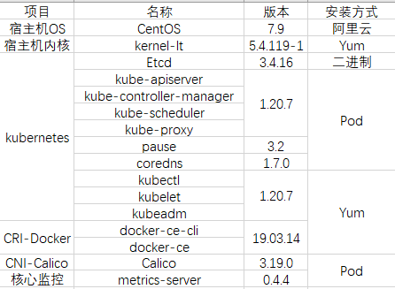
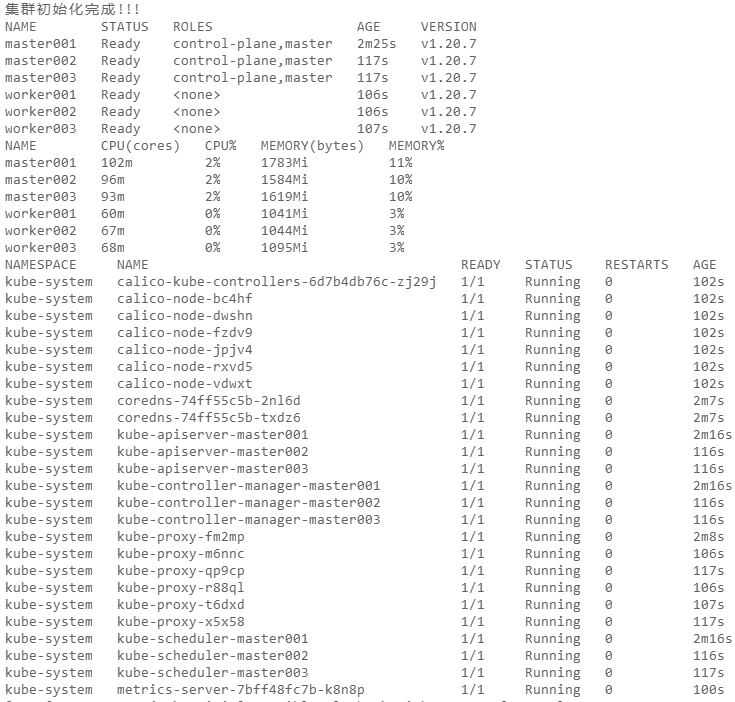

### 项目介绍

本项目是搭建高可用Kubernetes集群工作中的核心初始化部分的实现.采用控制机的方式依托自动化运维工具Ansible使用Kubeadm进行安装部署.整个流程不需要登录集群节点进行人工干预.安装完成之后集群规模是3M+3W的架构,软件和版本信息如下



### 使用方法

本项目部分软件需要通过yum安装,镜像需要从互联网拉取,所以在使用之前确保所有节点能够访问互联网,默认将/opt目录单独挂载了一块数据盘用于存放Docker数据、Etcd数据,所以集群准备的时候需要预留一块数据盘,当然也可以去掉对应的task,涉及更改文件
- roles/basic/tasks/main.yml

如按照默认架构安装部署还需要根据自己的环境修改以下文件

- hosts
- cfssl/ca-config.json
- cfssl/etcd-ca-csr.json
- group_vars/all
- roles/hostname/files/hosts

以上文件根据自己环境修改之后就可以进行安装工作
``` bash
bash ./init.sh
```
成功安装截图如下



在安装完成之后可以根据需要进行设置NodePort端口范围和开启kube-scheduler、kube-controller-manager非安全端口(解决执行`kubectl get cs`报错问题),如有需要操作如下
``` bash
ansible-playbook -i hosts complete.yml
```